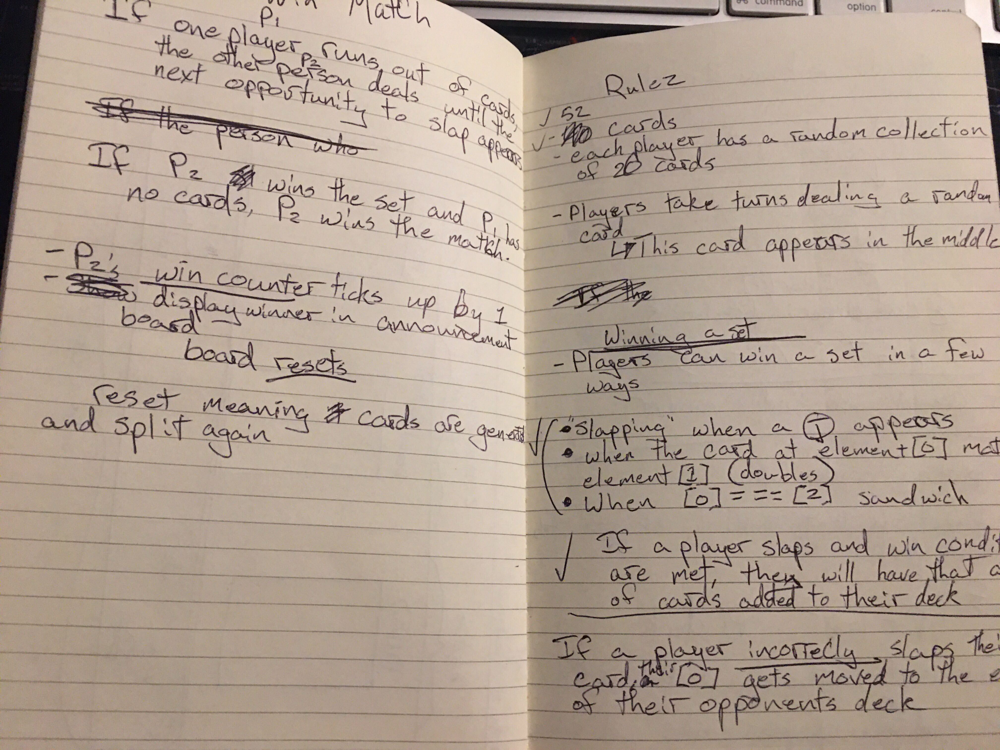
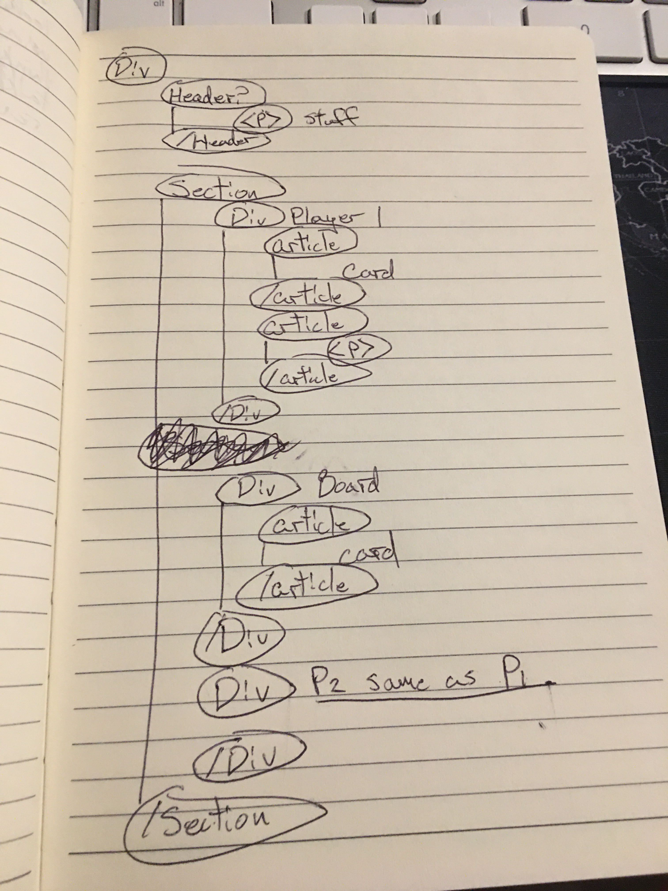
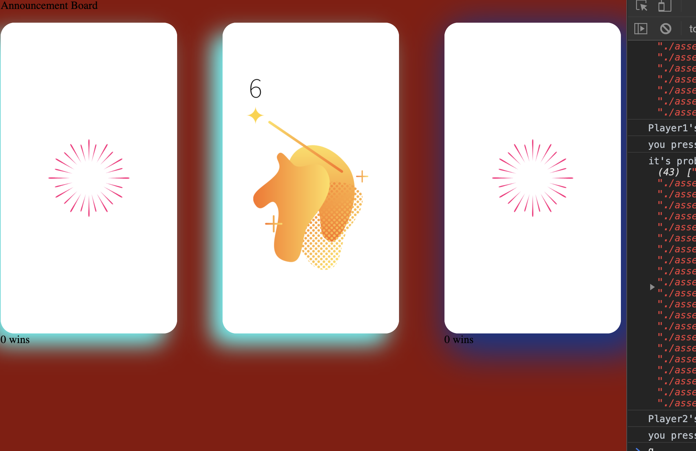
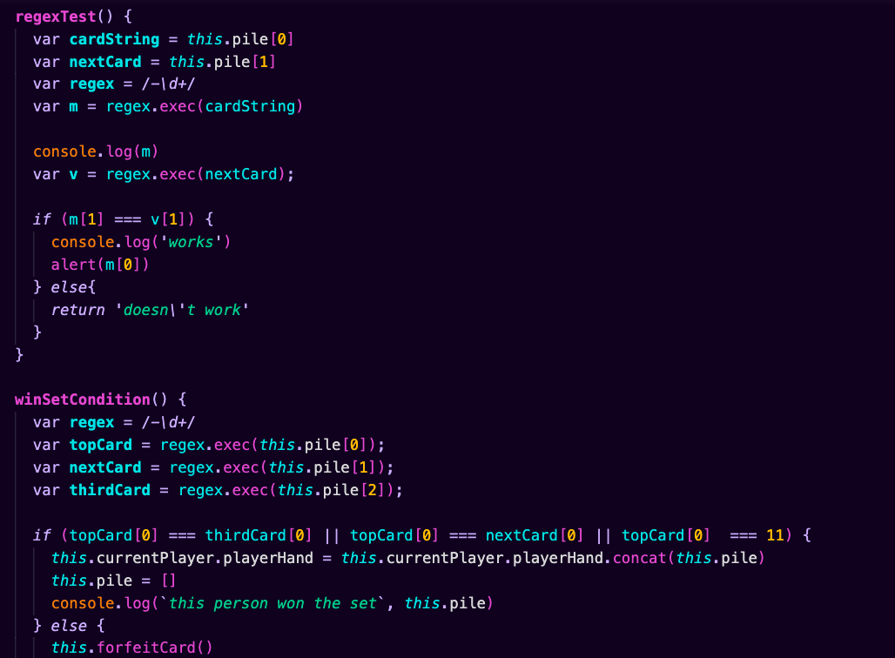
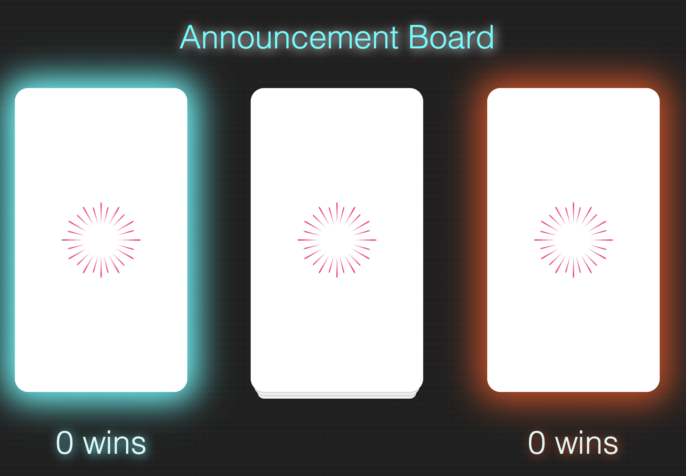
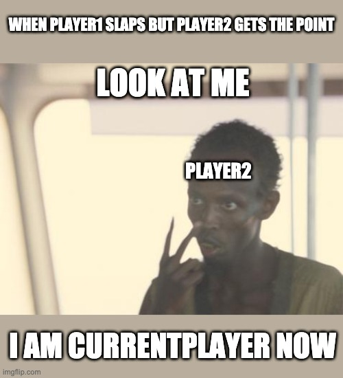

# slapjack
This is the final solo project for Mod 1, 2005, Turing School of Design

## Slapjack rules
Slapjack is a card game that has two players take turns dealing cards to a center pile faceup. Players can win the center pile by correctly slapping the card before the other player with these conditions:
- A Jack appears
- if the top card and the previous card are the same value(double)
- the top card matches the third card in the pile(sandwich)
The game ends when one the player with zero cards in hand loses a slap.

## A Road Map
Because the final assessment was on a Friday, actual coding did not occur until Saturday. However, I spent some time sketching a loose structure of the HTML and also explicitly writing out the rules as seen below, which clarified a lot of things when I actually got down to coding. Take a look at these oversized images!

## Dom vs Data Model
With what I knew about the dom and the data model, my approach was essentially 'I don't really care about the dom until I can kinda sorta play the game in the console' so the majority of my time was spent on the classes. Eventually, my CSS would gain some structure for the purposes of diving into main.js.

## Intro to Regex
As soon as I started the project, I was playing around with how to go about accessing the cards so they can be used to compare against each other. I played around with a repl that used mock numbers and experimented with a variety of ways. It wasn't until I stumbled on an Stack overflow thread that mentioned how it looks for paterns in strings. It was a gamble because it took so long to understand, but it was exciting once I was finally started making progress and realizing it was working as intended. Some particular roadblocks was not realizing that `exec` returns an array which is why it was initially claiming some properties or variables as undefined or not valid.

### Regex resources
Two primary videos were important for understanding regex:
- [Free Code Camp](https://www.youtube.com/watch?v=909NfO1St0A&t=197s)
- [Tech Sith](https://www.youtube.com/watch?v=rPNGB0ZLvdw&t=1s)

## CSS work
For the most part, the general CSS structure was fairly straight forward. Because I had some time left, I decided to restyle my red CSS background into something a bit cooler. I mostly blame the style for the [music](https://www.youtube.com/watch?v=9D2K2wvhinE) I was listening to that gave it a Tron like vibe. The background with the tiny grid is loosely based on [MetaKirby's](https://metakirby5.github.io/yorha/) template design off of Nier Automata's menu screen. I was able to figure out what was making the grid and replicate and enlarge them as I saw fit for this project.

It then led me down this rabbit-hole where I learned about box `shadow` and `text-shadow` which produces the glow.

## Challenges
For about two days, I was stuck on how the status of `currentPlayer` would be handled, if at all. early iterations had me making a property of a boolean property where `true` was player one and `false` was player 2. I'm still not 100% sure `game.player1Turn` is needed. With more time, I would probably refactor it to make more sense.

currentPlayer would continue to haunt me in main.js where the status of current player was being transferred as soon as a deal happened, so concatenation of cards would be distributed incorrectly. 

This would eventually lead me to changing the nature of my `swapCurrentPlayer` function; instead of switching it when a player deals, the player "becomes" the currentPlayer when an action is taken which would help when it came down to slapping cards.

## Room for improvement
As it is right now, functions are, in my opinion, a little tangled. Logic between checking the array, and then also displaying it properly was always messy, so if given the chance to revisit the project, I'd probably try to separate that code a bit more to make it DRY. Additionally, as of right now, localStorage has not been included in part because I'd rather spend the time left refactoring/cleaning up code but that can also be included in the future but were it included, it would probably trigger storing the data when someone won a match. Commits are also lower than I was hoping for but that's more or less because I was caught up in whatever problem remember to commit, other times, I wasn't sure if the code I was experimenting with was worth committing.

## Victories
Again, the gamble on regex turned out to be a huge win considering what I didn't really know where else to go. There might have been a simpler way but I'm still satisfied it worked AT ALL.

## Special Thanks
- [metakirby5](https://github.com/metakirby5/yorha)
- [Fisher-Yates](https://en.wikipedia.org/wiki/Fisher%E2%80%93Yates_shuffle)
- [Css tricks for showing me how to do a stacked paper effect that literally lasts until someone does anything on the dom](https://css-tricks.com/snippets/css/stack-of-paper/)
